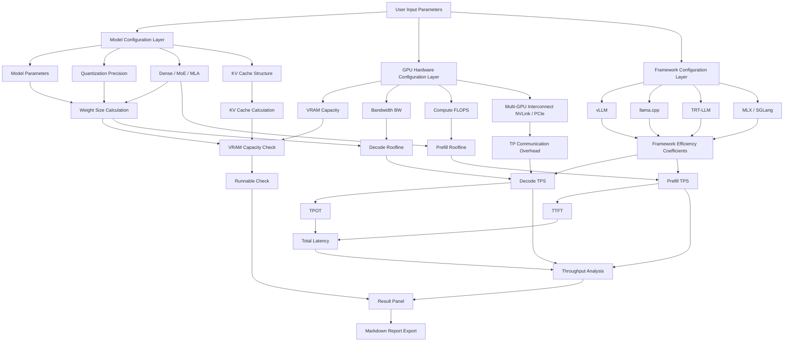

<p align="center">
  <br/>
  <br/>
  <br/>
  
  <br/>
  <br/>
</p>

<h1 align="center">TPS Calculator</h1>

<p align="center">
  <strong>GPU Inference Performance Estimator</strong>
</p>

<p align="center">
  Estimate VRAM usage, throughput, latency metrics, and bottleneck analysis<br/>given GPU, model, quantization, and runtime parameters
</p>

<p align="center">
  <a href="https://tps.bunai.cc"><strong>Live Demo →</strong></a>
</p>

<br/>

<p align="center">
  <a href="https://tps.bunai.cc">
    
  </a>
  <a href="LICENSE">
    
  </a>
  <a href="https://github.com/vuejs/core">
    
  </a>
  <a href="https://vitejs.dev">
    
  </a>
  <a href="README.md">
    
  </a>
</p>

<br/>
<br/>

## Features

- 🎯 **Accurate Modeling** — Weights, KV Cache, system overhead fully covered with OOM risk warnings
- ⚡ **Performance Analysis** — Precise Decode/Prefill token/s calculation, comprehensive TTFT/TPOT/total latency evaluation
- 📊 **Roofline Model** — Scientific bandwidth/compute bottleneck identification
- 🌍 **Wide Coverage** — 170+ GPU models, 351+ mainstream models (Dense 280 + MoE 71)
- 🔗 **Advanced Features** — Tensor Parallel, Flash Attention, KV Cache quantization, Prefix Cache
- 🎨 **Multi-Framework** — vLLM, TensorRT-LLM, SGLang, LMDeploy, TGI, llama.cpp, ExLlamaV2, MLX

## Coverage

| Category | Details |
| --- | --- |
| **Models** | 351+ mainstream models (Dense 280 + MoE 71) · 0.5B - 671B parameters · 2022-2026 releases |
| **Architectures** | Dense · MoE · MLA (DeepSeek) · Hybrid Attention (Gemma) · Mamba (SSM) |
| **GPUs** | 170+ models · NVIDIA (RTX/Tesla/H100) · AMD (RX/MI) · Intel Arc · Apple Silicon · Domestic chips |
| **Quantization** | FP32 · BF16 · FP8 · INT8 · INT4 · Q6_K · Q5_K · Q3_K · INT2 |
| **Frameworks** | vLLM · TensorRT-LLM · SGLang · LMDeploy · TGI · llama.cpp · ExLlamaV2 · MLX |
| **Advanced** | Flash Attention · KV Cache Quantization · Prefix Cache · MoE CPU Offload |

## Use Cases

**Best for:**
- 📚 Learning LLM inference performance modeling principles
- 🔬 Quick hardware selection and configuration comparison
- 🛠️ Validating hardware feasibility and estimating VRAM requirements
- 💡 Understanding quantization, KV Cache, TP, and Roofline concepts

**Not suitable for:**
- ❌ Replacing real benchmarks or production SLA commitments
- ❌ Precise cost calculations without real-world calibration
- ⚠️ Actual performance varies by drivers, system config, concurrency patterns, etc.

> **Note:** This is a learning reference tool. Always validate with real benchmarks before production deployment.

## Getting Started

### Online

Visit **[tps.bunai.cc](https://tps.bunai.cc)** to use it online without installation.

### Local Development

```bash
# Clone the repository
git clone https://github.com/yourusername/tps-calculator.git
cd tps-calculator

# Install dependencies
npm install

# Start dev server
npm run dev

# Build for production
npm run build

# Preview production build
npm run preview
```

### Requirements

- Node.js >= 18.0.0
- npm >= 9.0.0
- Modern browser (Chrome, Firefox, Safari, Edge)

## Project Structure

```
src/
├── components/       # Vue components
│   ├── config/      # Configuration panels (GPU/Model/Framework)
│   ├── result/      # Result displays (Speed/Latency/VRAM cards)
│   ├── layout/      # Layout components
│   └── ui/          # Generic UI components
├── data/            # Data definitions
│   ├── gpus/        # GPU specifications (by vendor)
│   ├── models/      # Model parameters (348+ models)
│   ├── constants.js # Quantization/Framework/Interconnect constants
│   └── runtime.js   # Runtime configuration options
├── utils/           # Utility functions
│   ├── calc.js      # Core calculation logic
│   ├── model.js     # Model structure analysis
│   ├── format.js    # Data formatting
│   ├── exportMd.js  # Markdown report export
│   ├── detectGpu.js # Local GPU auto-detection
│   └── useUrlState.js # URL state sync
├── i18n/            # Internationalization (Chinese/English)
├── pages/           # Page components
└── router/          # Router configuration
```

## Architecture

<details>
<summary>View system architecture diagram</summary>



**Key Implementation Highlights:**

- Weight quantization and KV Cache quantization modeling
- GQA/MHA/MQA structure coefficients for Prefill
- Flash Attention efficiency gains
- Prefix Cache support for TTFT optimization
- Framework efficiency intervals based on real benchmarks
- Multi-GPU TP communication overhead (NVLink/PCIe)

See [Docs.md](Docs.md) for detailed algorithms and formulas.

</details>

## Contributing

Contributions are welcome! We especially appreciate:

- 🔧 **GPU Data** — Add specifications for new GPU models
- 🤖 **Model Data** — Add structural parameters for new models
- 📊 **Framework Coefficients** — Provide real benchmark data to calibrate efficiency
- 🐛 **Bug Fixes** — Report or fix calculation errors
- 📝 **Documentation** — Improve explanations and examples

**Contribution workflow:**

1. Fork the repository
2. Create a feature branch (`git checkout -b feature/AmazingFeature`)
3. Commit your changes (`git commit -m 'Add some AmazingFeature'`)
4. Push to the branch (`git push origin feature/AmazingFeature`)
5. Open a Pull Request

## Disclaimer

This is a **learning reference tool** for understanding LLM inference performance modeling principles.

- ✅ Results are suitable for **trend analysis** and **architecture comparison**
- ⚠️ Actual performance is affected by many factors (driver version, system configuration, concurrency patterns, etc.)
- 🔬 **Always validate with real benchmarks before production deployment**
- 📊 Framework efficiency coefficients are based on limited samples and may vary significantly across scenarios

## License

This project uses a **Custom Non-Commercial License**. See [LICENSE](LICENSE) for details.

### Usage Terms

- ✅ **Personal Use** — Free to use for learning, research, and non-commercial purposes without authorization
- ⚠️ **Commercial Use** — Any use by companies/teams/commercial products (including secondary development, integration, plugins, derived services, etc.) requires written authorization from the author

**Dumb companies are forbidden to study.**

## Acknowledgments

### Data Sources

- **Model Parameters** — [HuggingFace](https://huggingface.co), [Ollama](https://ollama.com), [ModelScope](https://modelscope.cn) and other official model repositories
- **GPU Specifications** — Official technical documentation from various vendors
- **Model Coverage** — 351+ models spanning 2022-2026 mainstream open-source models, parameter scales from 0.5B to 671B

### Theoretical Foundation

- **Roofline Model** — Williams, Waterman & Patterson, [*Roofline: An Insightful Visual Performance Model*](https://dl.acm.org/doi/10.1145/1498765.1498785), CACM 2009
- **MoE CPU Offload** — [val1813/kaiwu](https://github.com/val1813/kaiwu) project inspired PCIe bandwidth bottleneck modeling

### Validation Data

- LMSYS DGX Spark Review
- XiongjieDai GPU Benchmarks
- vLLM Wide-EP Blog
- Community-contributed real-world test data

## Support

<div align="center">

| Currency | Address |
|:---:|:---|
| **USDT (Tron)** | `TMKDPMFNXukHbt1ThQxorCs9sZytSX7GkR` |
| **ETH (Ethereum)** | `0x5696293023683F7B5a0312eC9f0C1f05f2b03e81` |
| **SOL (Solana)** | `5avgsJtAdJst3KUdTsBsN2sUkyWYFrj8b1zADRPitTrj` |

**Your support motivates me to keep maintaining and improving this project!** 🙏

</div>

## Documentation

- **[Algorithm Documentation (Docs.md)](Docs.md)** — Detailed formulas, data flow, and implementation details
- **[中文文档 (README.md)](README.md)** — Chinese version of this document

## Contact

- 🐛 **Issue Reports** — [GitHub Issues](https://github.com/yourusername/tps-calculator/issues)
- 💬 **Discussions** — [GitHub Discussions](https://github.com/yourusername/tps-calculator/discussions)
- 📧 **Commercial Licensing** — Contact via Issues or project homepage

---

<div align="center">

**If this project helps you, please give it a ⭐ Star!**

Made with ❤️ for the LLM community

</div>
