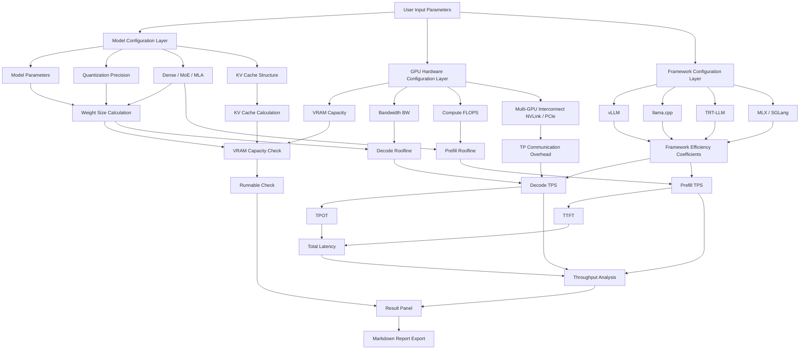

<div align="center">

# TPS Calculator

**GPU Inference Performance Estimator · Learning Reference Project**

[](LICENSE)
[](https://vuejs.org/)
[](https://vitejs.dev/)

[Live Demo](https://tps.bunai.cc) · [Algorithm Docs](Docs.md) · [中文文档](README.md)

</div>

---

## ✨ Features

Given GPU, model, quantization, and runtime parameters, quickly estimate:

- 🎯 **VRAM Usage** - Weights, KV Cache, system overhead, OOM risk warnings
- ⚡ **Throughput** - Decode/Prefill token/s with multi-framework efficiency modeling
- ⏱️ **Latency Metrics** - TTFT, TPOT, total latency estimation
- 🔍 **Bottleneck Analysis** - Roofline model to identify bandwidth/compute bottlenecks
- 🔗 **Multi-GPU Support** - Tensor Parallel communication efficiency modeling
- 🌍 **Wide Coverage** - 170+ GPUs (NVIDIA/AMD/Intel/Apple/Domestic), **348+ mainstream models**

## 📊 Coverage

| Category | Support |
|----------|---------|
| **GPUs** | NVIDIA (RTX/Tesla/H100), AMD (RX/MI), Intel Arc, Apple Silicon, Domestic chips |
| **Models** | **348+ mainstream models** (279 Dense + 69 MoE) |
| **Model Architectures** | Dense, MoE, MLA (DeepSeek), Hybrid Attention (Gemma), Mamba (SSM) |
| **Quantization** | FP32/BF16/FP8/INT8/INT4/Q6_K/Q5_K/Q3_K/INT2 |
| **Inference Frameworks** | vLLM, TensorRT-LLM, llama.cpp, MLX, SGLang, TGI |
| **Advanced Features** | Flash Attention, KV Cache Quantization, Prefix Cache, MoE CPU Offload |

### 🤖 Model Coverage

- **Parameter Scale**: 0.5B - 671B
- **Release Period**: 2022 - 2026 mainstream open-source models
- **Model Types**: 
  - 279 Dense models
  - 69 MoE (Mixture-of-Experts) models
- **Architecture Types**: Dense, MoE (Mixture-of-Experts), MLA (Multi-head Latent Attention), Hybrid Attention

## 🎯 Use Cases

### ✅ Best Used For

- 📚 Learning inference performance modeling principles
- 🔬 Initial architecture screening and parameter comparison
- 💡 Understanding quantization, KV Cache, TP, Roofline concepts
- 🛠️ Quick hardware configuration feasibility validation

### ❌ Not Suitable For

- 🚫 Direct replacement for real benchmarks
- 🚫 Production environment SLA commitments
- 🚫 Precise cost calculations (requires real-world calibration)

## 🚀 Quick Start

### Online Usage

Visit [tps.bunai.cc](https://tps.bunai.cc) to use directly without installation.

### Local Development

```bash
# Clone the repository
git clone https://github.com/yourusername/tps-calculator.git
cd tps-calculator

# Install dependencies
npm install

# Start development server
npm run dev

# Production build
npm run build

# Preview production build
npm run preview
```

### Project Structure

```
tps-calculator/
├── src/
│   ├── components/       # Vue components
│   │   ├── config/      # Configuration panels (GPU/Model/Framework selection)
│   │   ├── result/      # Result displays (Speed/Latency/VRAM cards)
│   │   ├── layout/      # Layout components
│   │   └── ui/          # Generic UI components
│   ├── data/            # Data definitions
│   │   ├── gpus/        # GPU specifications (organized by vendor)
│   │   ├── models/      # Model parameters (organized by series)
│   │   ├── constants.js # Quantization/Framework/Interconnect constants
│   │   └── runtime.js   # Runtime configuration options
│   ├── utils/           # Utility functions
│   │   ├── calc.js      # Core calculation logic
│   │   ├── model.js     # Model structure analysis
│   │   ├── format.js    # Data formatting
│   │   ├── exportMd.js  # Markdown report export
│   │   ├── detectGpu.js # Local GPU auto-detection
│   │   └── useUrlState.js # URL state sync
│   ├── i18n/            # Internationalization (Chinese/English)
│   ├── pages/           # Page components
│   └── router/          # Router configuration
├── Docs.md             # Detailed algorithm documentation
└── README.md           # This file
```

## 🏗️ System Architecture



### Architecture Overview

**Input Layer**
- User selects model, quantization, GPU, framework, batch size, context length

**Core Computation Layer**
- Weight size calculation
- KV Cache calculation
- VRAM feasibility check
- Decode Roofline analysis
- Prefill Roofline analysis
- Communication overhead
- Framework efficiency correction

**Output Layer**
- Runnable check
- Decode tok/s
- Prefill tok/s
- TTFT
- TPOT
- Total Latency
- Report export

## 📖 Documentation

- **[Algorithm Documentation (Docs.md)](Docs.md)** - Detailed formulas, data flow, and implementation details
- **[中文文档](README.md)** - Chinese version of this document

## 🤝 Contributing

Contributions are welcome! Especially in these areas:

- 🔧 **GPU Data** - Add specifications for new GPU models
- 🤖 **Model Data** - Add structural parameters for new models
- 📊 **Framework Coefficients** - Provide real benchmark data to calibrate framework efficiency
- 🐛 **Bug Fixes** - Report or fix calculation errors
- 📝 **Documentation** - Improve explanations and examples

## ⚠️ Disclaimer

This is a **learning reference project** for understanding inference performance modeling principles.

- ✅ Results are suitable for **trend analysis** and **architecture comparison**
- ⚠️ Actual performance is affected by many factors (driver version, system configuration, concurrency patterns, etc.)
- 🔬 **Always validate with real benchmarks before production deployment**
- 📊 Framework efficiency coefficients are based on limited samples and may vary significantly across scenarios

## 📄 License

This project uses a **Custom Non-Commercial License**. See [LICENSE](LICENSE) for details.

### Usage Terms

- ✅ **Personal Use** - Free to use for learning, research, and non-commercial purposes without authorization
- ⚠️ **Commercial Use** - Any use by companies/teams/commercial products (including secondary development, integration, plugins, derived services, etc.) requires written authorization from the author

**Dumb companies are forbidden to study.**

## 🙏 Acknowledgments

### Data Sources

- **Model Parameters** - [HuggingFace](https://huggingface.co), [Ollama](https://ollama.com), [ModelScope](https://modelscope.cn) and other official model repositories
- **GPU Specifications** - Official technical documentation from various vendors
- **Model Coverage** - 348+ models spanning 2022-2026 mainstream open-source models, parameter scales from 0.5B to 744B

### Theoretical Foundation

- **Roofline Model** - Williams, Waterman & Patterson, [*Roofline: An Insightful Visual Performance Model*](https://dl.acm.org/doi/10.1145/1498765.1498785), CACM 2009
- **MoE CPU Offload** - [val1813/kaiwu](https://github.com/val1813/kaiwu) project inspired PCIe bandwidth bottleneck modeling

### Validation Data

- LMSYS DGX Spark Review
- XiongjieDai GPU Benchmarks
- vLLM Wide-EP Blog
- Community-contributed real-world test data

## 📮 Contact

- 🐛 **Issue Reports** - [GitHub Issues](https://github.com/yourusername/tps-calculator/issues)
- 💬 **Discussions** - [GitHub Discussions](https://github.com/yourusername/tps-calculator/discussions)
- 📧 **Commercial Licensing** - Contact via Issues or project homepage

---

<div align="center">

**If this project helps you, please give it a ⭐ Star!**

Made with ❤️ for the LLM community

</div>
