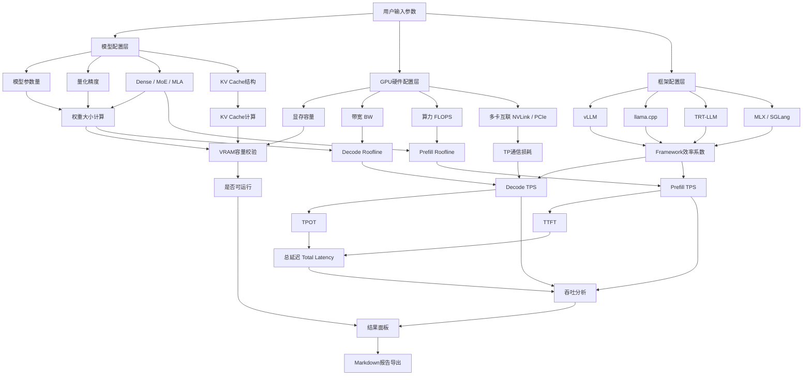

<p align="center">
  <br/>
  <br/>
  <br/>
  
  <br/>
  <br/>
</p>

<h1 align="center">TPS Calculator</h1>

<p align="center">
  <strong>Herramienta de estimación de rendimiento de inferencia de GPU</strong>
</p>

<p align="center">
  Dadas una GPU, un modelo, la cuantización y los parámetros de ejecución, estima rápidamente el uso de memoria VRAM, el rendimiento de throughput, las métricas de latencia y el análisis de cuellos de botella
</p>

<p align="center">
  <a href="https://tps.bunai.cc"><strong>Prueba en línea →</strong></a>
</p>

<br/>

<p align="center">
  <a href="https://tps.bunai.cc">
    
  </a>
  <a href="LICENSE">
    
  </a>
  <a href="https://github.com/vuejs/core">
    
  </a>
  <a href="https://vitejs.dev">
    
  </a>
  <a href="README.en.md">
    
  </a>
</p>

<br/>
<br/>

## Características

- 🎯 **Modelado preciso** — Cobertura total de pesos, KV Cache y sobrecarga del sistema, alerta de riesgo OOM
- ⚡ **Análisis de rendimiento** — Cálculo preciso de tokens/s en Decode/Prefill, evaluación completa de TTFT/TPOT/latencia total
- 📊 **Modelo Roofline** — Identificación científica de cuellos de botella de ancho de banda/rendimiento computacional
- 🌍 **Amplia cobertura** — 170+ modelos de GPU, 351+ modelos principales (Dense 280 + MoE 71)
- 🔗 **Características avanzadas** — Paralelismo Tensor, Flash Attention, cuantización de KV Cache, Prefix Cache
- 🎨 **Soporte multi-framework** — vLLM、TensorRT-LLM、SGLang、LMDeploy、TGI、llama.cpp、ExLlamaV2、MLX

## Alcance de soporte

| Categoría | Detalles |
| --- | --- |
| **Modelos** | 351+ modelos principales (Dense 280 + MoE 71) · 0.5B - 671B parámetros · Publicados entre 2022-2026 |
| **Arquitecturas** | Dense · MoE · MLA (DeepSeek) · Atención híbrida (Gemma) · Mamba (SSM) |
| **GPU** | 170+ modelos · NVIDIA (RTX/Tesla/H100/B200/B300) · AMD (RX/MI) · Intel Arc · Apple Silicon · Chips nacionales |
| **Cuantización** | FP32 · BF16 · FP8 · INT8 · INT4 · Q6_K · Q5_K · Q3_K · INT2 |
| **Frameworks** | vLLM · TensorRT-LLM · SGLang · LMDeploy · TGI · llama.cpp · ExLlamaV2 · MLX |
| **Características avanzadas** | Flash Attention · Cuantización de KV Cache · Prefix Cache · MoE CPU Offload |

## Casos de uso

**Adecuado para:**
- 📚 Aprender los principios de modelado de rendimiento de inferencia de LLM
- 🔬 Comparación rápida de selección de hardware y planes de configuración
- 🛠️ Verificación de viabilidad de hardware y estimación de requisitos de VRAM
- 💡 Comprender conceptos como cuantización, KV Cache, TP y Roofline

**No adecuado para:**
- ❌ Reemplazar benchmarks reales o compromisos de SLA en entornos de producción
- ❌ Cálculo de costos preciso sin calibración mediante pruebas reales
- ⚠️ El rendimiento real está influenciado por múltiples factores como versión del controlador, configuración del sistema, modo de concurrencia, etc.

> **Nota:** Esta es una herramienta de referencia para aprendizaje. Es fundamental realizar pruebas de estrés reales antes del despliegue en producción.

## Inicio rápido

### Uso en línea

Visita **[tps.bunai.cc](https://tps.bunai.cc)** para usarlo sin necesidad de instalación.

### Desarrollo local

```bash
# 克隆项目
git clone https://github.com/yourusername/tps-calculator.git
cd tps-calculator

# 安装依赖
npm install

# 启动开发服务器
npm run dev

# 生产构建
npm run build

# 预览生产构建
npm run preview
```

### Requisitos del entorno

- Node.js >= 18.0.0
- npm >= 9.0.0
- Navegadores modernos (Chrome, Firefox, Safari, Edge)

## Estructura del proyecto

```
src/
├── components/       # Componentes Vue
│   ├── config/      # Panel de configuración (Selección GPU/Modelo/Framework)
│   ├── result/      # Visualización de resultados (Tarjetas de velocidad/latencia/VRAM)
│   ├── layout/      # Componentes de layout
│   └── ui/          # Componentes UI genéricos
├── data/            # Definición de datos
│   ├── gpus/        # Datos de especificaciones GPU (Clasificados por fabricante)
│   ├── models/      # Datos de parámetros de modelos (348+ modelos)
│   ├── constants.js # Constantes de cuantización/framework/interconexión
│   └── runtime.js   # Opciones de configuración en tiempo de ejecución
├── utils/           # Funciones utilitarias
│   ├── calc.js      # Lógica de cálculo central
│   ├── model.js     # Análisis de estructura de modelo
│   ├── format.js    # Formateo de datos
│   ├── exportMd.js  # Exportación de informes Markdown
│   ├── detectGpu.js # Detección automática de GPU local
│   └── useUrlState.js # Sincronización de estado URL
├── i18n/            # Internacionalización (Chino/Inglés)
├── pages/           # Componentes de página
└── router/          # Configuración de enrutamiento
```

## Arquitectura del sistema

<details>
<summary>Ver diagrama de arquitectura del sistema</summary>



**Puntos destacados de la implementación central:**

- Modelado de cuantización de pesos y KV Cache
- Impacto de los coeficientes estructurales GQA/MHA/MQA en Prefill
- Ganancia de eficiencia de Flash Attention
- Soporte de optimización de Prefix Cache para TTFT
- Rangos de eficiencia de framework basados en benchmarks reales
- Sobrecarga de comunicación TP multicard (NVLink/PCIe)

Consulta los algoritmos y fórmulas detallados en [Docs.md](Docs.md).

</details>

## Guía de contribución

¡Las contribuciones son bienvenidas! Agradecemos especialmente:

- 🔧 **Datos de GPU** — Agregar especificaciones de nuevos modelos de GPU
- 🤖 **Datos de modelos** — Agregar parámetros estructurales de nuevos modelos
- 📊 **Coeficientes de framework** — Proveer datos de benchmarks reales para calibrar la eficiencia
- 🐛 **Corrección de errores** — Reportar o corregir errores de cálculo
- 📝 **Mejoras de documentación** — Refinar explicaciones y ejemplos

**Proceso de contribución:**

1. Haz un fork de este repositorio
2. Crea una rama de característica (`git checkout -b feature/AmazingFeature`)
3. Realiza commit de cambios (`git commit -m 'Add some AmazingFeature'`)
4. Empuja a la rama (`git push origin feature/AmazingFeature`)
5. Envía un Pull Request

## Descargo de responsabilidad

Esta es una **herramienta de referencia para aprendizaje**, diseñada para comprender los principios de modelado de rendimiento de inferencia de LLM.

- ✅ Los resultados son aptos para **análisis de tendencias** y **comparación de arquitecturas**
- ⚠️ El rendimiento real está influenciado por múltiples factores (versión del controlador, configuración del sistema, modo de concurrencia, etc.)
- 🔬 **Es fundamental realizar pruebas de estrés reales antes del despliegue en producción**
- 📊 Los coeficientes de eficiencia de framework se basan en muestras limitadas y pueden variar significativamente según el escenario

## Licencia de código abierto

Este proyecto utiliza una **licencia personalizada de uso no comercial**, consulta [LICENSE](LICENSE) para detalles.

### Términos de uso

- ✅ **Uso personal** — Libre para aprendizaje, investigación y fines no comerciales, sin necesidad de autorización
- ⚠️ **Uso comercial** — Para empresas/equipos/productos comerciales (incluyendo desarrollo secundario, integración, plugins, servicios derivados, etc.) se requiere contactar al autor para obtener autorización por escrito

**Está prohibido aprender para empresas estúpidas.**

## Agradecimientos

### Fuentes de datos

- **Parámetros de modelo** — Repositorios oficiales como [HuggingFace](https://huggingface.co), [Ollama](https://ollama.com), [ModelScope](https://modelscope.cn)
- **Especificaciones de GPU** — Documentación técnica oficial de los fabricantes
- **Cobertura de modelos** — 351+ modelos, abarcando modelos de código abierto principales de 2022-2026, con escalas de parámetros de 0.5B a 671B

### Base teórica

- **Modelo Roofline** — Williams, Waterman & Patterson, [*Roofline: An Insightful Visual Performance Model*](https://dl.acm.org/doi/10.1145/1498765.1498785), CACM 2009
- **MoE CPU Offload** — El proyecto [val1813/kaiwu](https://github.com/val1813/kaiwu) inspiró el modelado del cuello de botella de ancho de banda PCIe

### Datos de validación

- LMSYS DGX Spark Review
- XiongjieDai GPU Benchmarks
- Blog vLLM Wide-EP
- Datos de pruebas reales contribuidos por la comunidad

## Apoya al proyecto

<div align="center">

| Moneda | Dirección |
|:---:|:---|
| **USDT (Tron)** | `TMKDPMFNXukHbt1ThQxorCs9sZytSX7GkR` |
| **ETH (Ethereum)** | `0x5696293023683F7B5a0312eC9f0C1f05f2b03e81` |
| **SOL (Solana)** | `5avgsJtAdJst3KUdTsBsN2sUkyWYFrj8b1zADRPitTrj` |

**¡Tu apoyo es mi motivación para mantener y mejorar continuamente el proyecto!** 🙏

</div>

## Documentación

- **[Documentación de algoritmos (Docs.md)](Docs.md)** — Fórmulas de cálculo detalladas, flujos de datos y detalles de implementación
- **[English README](README.en.md)** — English version of this document

## Contacto

- 🐛 **Informes de problemas** — [GitHub Issues](https://github.com/yourusername/tps-calculator/issues)
- 💬 **Discusiones** — [GitHub Discussions](https://github.com/yourusername/tps-calculator/discussions)
- 📧 **Licencia comercial** — Por favor, contacta mediante Issues o la página principal del proyecto

---

<div align="center">

**¡Si este proyecto te ha sido útil, dale un ⭐ Star para apoyar!**

Made with ❤️ for the LLM community

</div>
