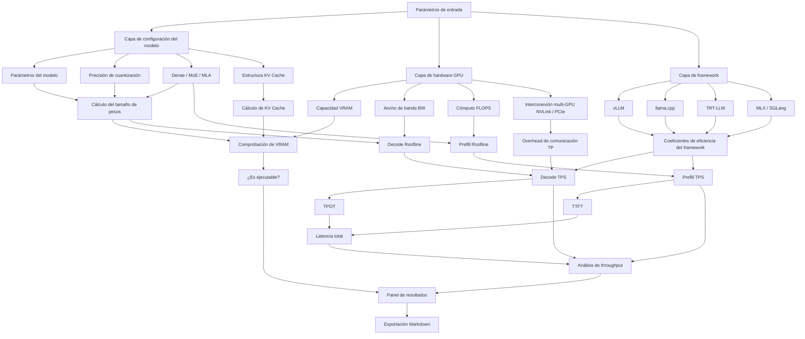

<p align="center">
  <br/>
  <br/>
  <br/>
  
  <br/>
  <br/>
</p>

<h1 align="center">TPS Calculator</h1>

<p align="center">
  <strong>Herramienta de estimación de rendimiento de inferencia en GPU</strong>
</p>

<p align="center">
  A partir de la GPU, el modelo, la cuantización y los parámetros de ejecución,<br/>
  estima rápidamente el uso de VRAM, el throughput, la latencia y los cuellos de botella
</p>

<p align="center">
  <a href="https://tps.bunai.cc"><strong>Probar en línea →</strong></a>
</p>

<br/>

<p align="center">
  <a href="https://tps.bunai.cc">
    
  </a>
  <a href="LICENSE">
    
  </a>
  <a href="https://github.com/vuejs/core">
    
  </a>
  <a href="https://vitejs.dev">
    
  </a>
  <a href="README.md">
    
  </a>
  <a href="README.en.md">
    
  </a>
</p>

<br/>
<br/>

## Características

- 🎯 **Modelado preciso** — Cobertura completa de pesos, KV Cache y sobrecarga del sistema, con alerta de riesgo OOM
- ⚡ **Análisis de rendimiento** — Cálculo preciso de tokens/s en Decode/Prefill; evaluación de TTFT/TPOT/latencia total
- 📊 **Modelo Roofline** — Identificación científica de cuellos de botella de ancho de banda y cómputo
- 🌍 **Amplia cobertura** — 250+ GPUs, 393+ modelos principales (Dense 302 + MoE 91)
- 🔗 **Funciones avanzadas** — Tensor Parallel, Flash Attention, cuantización de KV Cache, Prefix Cache
- 🎨 **Multi-framework** — vLLM, TensorRT-LLM, SGLang, LMDeploy, TGI, llama.cpp, ExLlamaV2, MLX

## Alcance

| Categoría | Detalles |
| --- | --- |
| **Modelos** | 393+ modelos principales (Dense 302 + MoE 91) · 0.5B - 2.8T parámetros · Publicados 2022-2026 |
| **Arquitecturas** | Dense · MoE · MLA (DeepSeek) · Atención híbrida (Gemma) · Mamba (SSM) |
| **GPU** | 250+ modelos · NVIDIA (RTX/Tesla/H100/B200/B300) · AMD (RX/MI) · Intel Arc · Apple Silicon · Chips chinos |
| **Cuantización** | FP32 · BF16 · FP8 · INT8 · INT4 · Q6_K · Q5_K · Q3_K · INT2 |
| **Frameworks** | vLLM · TensorRT-LLM · SGLang · LMDeploy · TGI · llama.cpp · ExLlamaV2 · MLX |
| **Avanzado** | Flash Attention · Cuantización de KV Cache · Prefix Cache · MoE CPU Offload |

## Casos de uso

**Adecuado para:**
- 📚 Aprender los principios de modelado de rendimiento de inferencia LLM
- 🔬 Comparar rápidamente hardware y configuraciones
- 🛠️ Validar viabilidad de hardware y estimar requisitos de VRAM
- 💡 Entender cuantización, KV Cache, TP, Roofline, etc.

**No adecuado para:**
- ❌ Sustituir benchmarks reales o compromisos de SLA en producción
- ❌ Contabilidad de costes precisa sin calibración con mediciones reales
- ⚠️ El rendimiento real depende del driver, la configuración del sistema, el modo de concurrencia, etc.

> **Nota:** Es una herramienta de referencia para aprendizaje. Valida siempre con pruebas reales antes del despliegue en producción.

## Inicio rápido

### Uso en línea

Visita **[tps.bunai.cc](https://tps.bunai.cc)**; no hace falta instalar nada.

### Desarrollo local

```bash
# Clonar el repositorio
git clone https://github.com/yourusername/tps-calculator.git
cd tps-calculator

# Instalar dependencias
npm install

# Arrancar el servidor de desarrollo
npm run dev

# Build de producción
npm run build

# Previsualizar el build de producción
npm run preview
```

### Requisitos

- Node.js >= 18.0.0
- npm >= 9.0.0
- Navegador moderno (Chrome, Firefox, Safari, Edge)

## Estructura del proyecto

```
src/
├── components/       # Componentes Vue
│   ├── config/      # Panel de configuración (GPU / modelo / framework)
│   ├── result/      # Resultados (velocidad / latencia / VRAM)
│   ├── layout/      # Layout
│   └── ui/          # UI genérica
├── data/            # Datos
│   ├── gpus/        # Especificaciones GPU (por fabricante)
│   ├── models/      # Parámetros de modelos (393+)
│   ├── constants.js # Constantes de cuantización / framework / interconexión
│   └── runtime.js   # Opciones de configuración en runtime
├── utils/           # Utilidades
│   ├── calc.js      # Lógica de cálculo principal
│   ├── model.js     # Análisis de estructura del modelo
│   ├── format.js    # Formateo
│   ├── exportMd.js  # Exportación de informe Markdown
│   ├── detectGpu.js # Detección automática de GPU local
│   └── useUrlState.js # Sincronización de estado vía URL
├── i18n/            # Internacionalización (chino / inglés)
├── pages/           # Páginas
└── router/          # Enrutamiento
```

## Arquitectura del sistema

<details>
<summary>Ver diagrama de arquitectura</summary>



**Puntos clave de la implementación:**

- Modelado de cuantización de pesos y KV Cache
- Impacto de los coeficientes estructurales GQA/MHA/MQA en Prefill
- Ganancia de eficiencia de Flash Attention
- Optimización de TTFT con Prefix Cache
- Intervalos de eficiencia de framework basados en benchmarks reales
- Overhead de comunicación TP multi-GPU (NVLink/PCIe)

</details>

## Guía de contribución

¡Las contribuciones son bienvenidas! Especialmente:

- 🔧 **Datos de GPU** — Añadir especificaciones de nuevos modelos de GPU
- 🤖 **Datos de modelos** — Añadir parámetros estructurales de nuevos modelos
- 📊 **Coeficientes de framework** — Aportar benchmarks reales para calibrar la eficiencia
- 🐛 **Corrección de errores** — Reportar o corregir errores de cálculo
- 📝 **Documentación** — Mejorar explicaciones y ejemplos

**Flujo de contribución:**

1. Haz fork del repositorio
2. Crea una rama de feature (`git checkout -b feature/AmazingFeature`)
3. Haz commit (`git commit -m 'Add some AmazingFeature'`)
4. Empuja la rama (`git push origin feature/AmazingFeature`)
5. Abre un Pull Request

## Descargo de responsabilidad

Esta es una **herramienta de referencia para aprendizaje**, orientada a comprender el modelado de rendimiento de inferencia LLM.

- ✅ Los resultados sirven para **análisis de tendencias** y **comparación de arquitecturas**
- ⚠️ El rendimiento real depende de muchos factores (driver, sistema, concurrencia, etc.)
- 🔬 **Valida siempre con pruebas reales antes del despliegue en producción**
- 📊 Los coeficientes de eficiencia del framework se basan en muestras limitadas y pueden variar mucho según el escenario

## Licencia

Este proyecto usa una **licencia personalizada de uso no comercial**. Consulta [LICENSE](LICENSE).

### Términos de uso

- ✅ **Uso personal** — Aprendizaje, investigación y fines no comerciales, sin autorización
- ⚠️ **Uso comercial** — Empresas / equipos / productos comerciales (incluido desarrollo secundario, integración, plugins, servicios derivados, etc.) requieren autorización escrita del autor

**A las empresas idiotas les está prohibido aprender.**

## Agradecimientos

### Fuentes de datos

- **Parámetros de modelo** — [HuggingFace](https://huggingface.co), [Ollama](https://ollama.com), [ModelScope](https://modelscope.cn) y otros repositorios oficiales
- **Especificaciones de GPU** — Documentación técnica oficial de los fabricantes
- **Cobertura de modelos** — 393+ modelos open source principales (2022-2026), de 0.5B a 2.8T parámetros

### Base teórica

- **Modelo Roofline** — Williams, Waterman & Patterson, [*Roofline: An Insightful Visual Performance Model*](https://dl.acm.org/doi/10.1145/1498765.1498785), CACM 2009
- **MoE CPU Offload** — El proyecto [val1813/kaiwu](https://github.com/val1813/kaiwu) inspiró el modelado del cuello de botella de ancho de banda PCIe

### Datos de validación

- LMSYS DGX Spark Review
- XiongjieDai GPU Benchmarks
- vLLM Wide-EP Blog
- Datos de pruebas reales aportados por la comunidad

## Apoyar el proyecto

<div align="center">

| Moneda | Dirección |
|:---:|:---|
| **USDT (Tron)** | `TMKDPMFNXukHbt1ThQxorCs9sZytSX7GkR` |
| **ETH (Ethereum)** | `0x5696293023683F7B5a0312eC9f0C1f05f2b03e81` |
| **SOL (Solana)** | `5avgsJtAdJst3KUdTsBsN2sUkyWYFrj8b1zADRPitTrj` |

**¡Tu apoyo motiva a seguir manteniendo y mejorando el proyecto!** 🙏

</div>

## Documentación

- **[中文 README](README.md)** — Versión en chino
- **[English README](README.en.md)** — Versión en inglés

## Contacto

- 🐛 **Incidencias** — [GitHub Issues](https://github.com/yourusername/tps-calculator/issues)
- 💬 **Discusiones** — [GitHub Discussions](https://github.com/yourusername/tps-calculator/discussions)
- 📧 **Licencia comercial** — Contacta por Issues o la página del proyecto

---

<div align="center">

**Si este proyecto te resulta útil, ¡deja un ⭐ Star!**

Made with ❤️ for the LLM community

</div>
