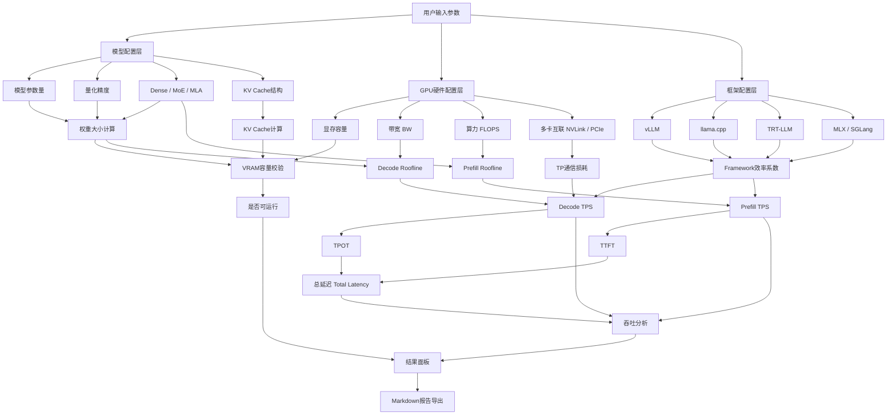

<div align="center">

# TPS Calculator

**GPU 推理性能估算工具 · 学习参考项目**

[](LICENSE)
[](https://vuejs.org/)
[](https://vitejs.dev/)

[在线体验](https://tps.bunai.cc) · [算法文档](Docs.md) · [English](README.en.md)

</div>

---

## ✨ 特性

给定 GPU、模型、量化与运行参数，快速估算：

- 🎯 **显存占用** - 权重、KV Cache、系统开销，OOM 风险预警
- ⚡ **吞吐性能** - Decode/Prefill token/s，支持多框架效率建模
- ⏱️ **延迟指标** - TTFT、TPOT、总延迟估算
- 🔍 **瓶颈分析** - Roofline 模型，识别带宽/算力瓶颈
- 🔗 **多卡支持** - Tensor Parallel 通信效率建模
- 🌍 **广泛覆盖** - 170+ GPU（NVIDIA/AMD/Intel/Apple/国产），**340+ 主流模型**

## 📊 支持范围

| 类别 | 支持内容 |
|------|---------|
| **GPU** | NVIDIA (RTX/Tesla/H100)、AMD (RX/MI)、Intel Arc、Apple Silicon、国产芯片 |
| **模型** | **340+ 主流模型**（Dense 密集模型 280 个 + MoE 混合专家 60 个） |
| **模型架构** | Dense、MoE、MLA (DeepSeek)、混合注意力 (Gemma)、Mamba (SSM) |
| **量化精度** | FP32/BF16/FP8/INT8/INT4/Q6_K/Q5_K/Q3_K/INT2 |
| **推理框架** | vLLM、TensorRT-LLM、llama.cpp、MLX、SGLang、TGI |
| **高级特性** | Flash Attention、KV Cache 量化、Prefix Cache、MoE CPU Offload |

### 🤖 模型覆盖

- **参数规模**: 0.5B - 671B
- **发布时间**: 2022 - 2026 年主流开源模型
- **模型类型**: 
  - Dense 密集模型 280 个
  - MoE 混合专家模型 60 个
- **架构类型**: Dense (密集)、MoE (混合专家)、MLA (多头潜在注意力)、混合注意力

## 🎯 适用场景

### ✅ 适合用于

- 📚 学习推理性能建模原理
- 🔬 方案初筛和参数对比
- 💡 理解量化、KV Cache、TP、Roofline 等概念
- 🛠️ 快速验证硬件配置可行性

### ❌ 不适合用于

- 🚫 直接替代真实 benchmark
- 🚫 作为生产环境 SLA 承诺
- 🚫 精确的成本核算（需实测校准）

## 系统架构



### 架构说明

**输入层**
- 用户选择模型、量化、GPU、框架、batch、上下文长度

**核心计算层**
- 权重大小
- KV Cache
- VRAM 可运行性
- Decode Roofline
- Prefill Roofline
- 通信损耗
- Framework 效率修正

**输出层**
- 可运行性判断
- Decode tok/s
- Prefill tok/s
- TTFT
- TPOT
- Total Latency
- 报告导出

## 当前实现重点

当前代码已经把这些因素接进计算：

- 权重量化和 KV Cache 量化
- GQA / MHA / MQA 对 prefill 的结构系数
- Flash Attention 对 prefill 的区间增益
- Prefix Cache 对有效 Prompt 和 TTFT 的影响
- 框架效率区间
- 多卡 TP 通信效率

想看真实算法，请直接读 [Docs.md](Docs.md)。这份文档是按当前代码写的，不是脱离实现的示意稿。

## 🚀 快速开始

### 在线使用

访问 [tps.bunai.cc](https://tps.bunai.cc) 直接使用，无需安装。

### 本地开发

```bash
# 克隆项目
git clone https://github.com/yourusername/tps-calculator.git
cd tps-calculator

# 安装依赖
npm install

# 启动开发服务器
npm run dev

# 生产构建
npm run build

# 预览生产构建
npm run preview
```

### 项目结构

```
tps-calculator/
├── src/
│   ├── components/       # Vue 组件
│   │   ├── config/      # 配置面板（GPU/模型/框架选择）
│   │   ├── result/      # 结果展示（速度/延迟/显存卡片）
│   │   ├── layout/      # 布局组件
│   │   └── ui/          # 通用 UI 组件
│   ├── data/            # 数据定义
│   │   ├── gpus/        # GPU 规格数据（按厂商分类）
│   │   ├── models/      # 模型参数数据（按系列分类）
│   │   ├── constants.js # 量化/框架/互联常量
│   │   └── runtime.js   # 运行时配置选项
│   ├── utils/           # 工具函数
│   │   ├── calc.js      # 核心计算逻辑
│   │   ├── model.js     # 模型结构分析
│   │   ├── format.js    # 数据格式化
│   │   ├── exportMd.js  # Markdown 报告导出
│   │   ├── detectGpu.js # 本地 GPU 自动检测
│   │   └── useUrlState.js # URL 状态同步
│   ├── i18n/            # 国际化（中文/英文）
│   ├── pages/           # 页面组件
│   └── router/          # 路由配置
├── Docs.md             # 算法详细文档
└── README.md           # 本文件
```

## 📖 文档

- **[算法文档 (Docs.md)](Docs.md)** - 详细的计算公式、数据流和实现细节
- **[English README](README.en.md)** - English version of this document

## 🤝 贡献指南

欢迎贡献！特别是以下方面：

- 🔧 **GPU 数据** - 补充新 GPU 型号的规格参数
- 🤖 **模型数据** - 添加新模型的结构参数
- 📊 **框架系数** - 提供真实 benchmark 数据校准框架效率
- 🐛 **Bug 修复** - 报告或修复计算错误
- 📝 **文档改进** - 完善说明和示例

## ⚠️ 免责声明

这是一个**学习参考项目**，用于理解推理性能建模原理。

- ✅ 结果适合用于**趋势分析**和**方案对比**
- ⚠️ 实际性能受多种因素影响（驱动版本、系统配置、并发模式等）
- 🔬 **生产部署前务必进行真实压测验证**
- 📊 框架效率系数基于有限样本，不同场景可能有较大偏差

## 📄 开源协议

本项目采用**自定义非商业协议**，详见 [LICENSE](LICENSE)。

### 使用条款

- ✅ **个人使用** - 学习、研究、非商业用途自由使用，无需授权
- ⚠️ **商业使用** - 公司/团队/商业产品使用（包括二次开发、集成、插件化、衍生服务等）需联系作者获得书面授权

**傻逼公司禁止学习。**

## 🙏 致谢

### 数据来源

- **模型参数** - [HuggingFace](https://huggingface.co)、[Ollama](https://ollama.com)、[ModelScope](https://modelscope.cn) 等官方模型库
- **GPU 规格** - 各厂商官方技术文档
- **模型覆盖** - 340+ 模型，涵盖 2022-2026 年主流开源模型，参数规模从 0.5B 到 671B

### 理论基础

- **Roofline 模型** - Williams, Waterman & Patterson, [*Roofline: An Insightful Visual Performance Model*](https://dl.acm.org/doi/10.1145/1498765.1498785), CACM 2009
- **MoE CPU Offload** - [val1813/kaiwu](https://github.com/val1813/kaiwu) 项目启发了 PCIe 带宽瓶颈建模

### 验证数据

- LMSYS DGX Spark Review
- XiongjieDai GPU Benchmarks
- vLLM Wide-EP Blog
- 社区贡献的真实测试数据

## 📮 联系方式

- 🐛 **问题反馈** - [GitHub Issues](https://github.com/yourusername/tps-calculator/issues)
- 💬 **讨论交流** - [GitHub Discussions](https://github.com/yourusername/tps-calculator/discussions)
- 📧 **商业授权** - 请通过 Issues 或项目主页联系

---

<div align="center">

**如果这个项目对你有帮助，请给个 ⭐ Star 支持一下！**

Made with ❤️ for the LLM community

</div>
