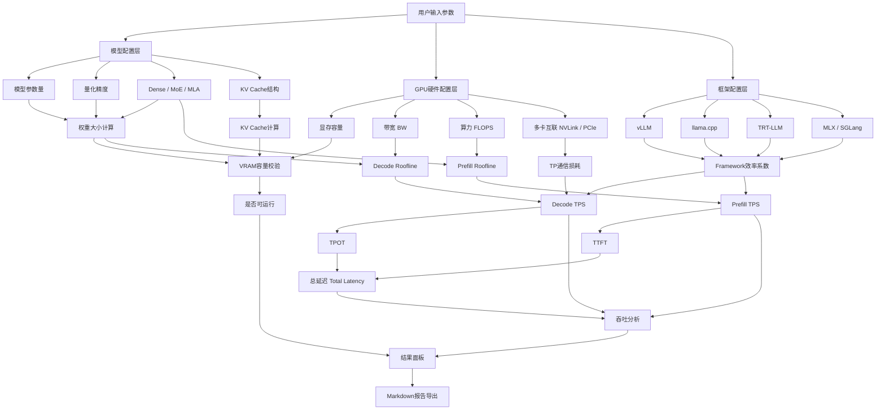

<p align="center">
  <br/>
  <br/>
  <br/>
  
  <br/>
  <br/>
</p>

<h1 align="center">TPS Calculator</h1>

<p align="center">
  <strong>GPU 推理性能估算工具</strong>
</p>

<p align="center">
  给定 GPU、模型、量化与运行参数，快速估算显存占用、吞吐性能、延迟指标与瓶颈分析
</p>

<p align="center">
  <a href="https://tps.bunai.cc"><strong>在线体验 →</strong></a>
</p>

<br/>

<p align="center">
  <a href="https://tps.bunai.cc">
    
  </a>
  <a href="LICENSE">
    
  </a>
  <a href="https://github.com/vuejs/core">
    
  </a>
  <a href="https://vitejs.dev">
    
  </a>
  <a href="README.en.md">
    
  </a>
</p>

<br/>
<br/>

## 特性

- 🎯 **精准建模** — 权重、KV Cache、系统开销全覆盖，OOM 风险预警
- ⚡ **性能分析** — Decode/Prefill token/s 精确计算，TTFT/TPOT/总延迟全面评估
- 📊 **Roofline 模型** — 科学识别带宽/算力瓶颈
- 🌍 **广泛覆盖** — 170+ GPU 型号，351+ 主流模型（Dense 280 + MoE 71）
- 🔗 **高级特性** — Tensor Parallel、Flash Attention、KV Cache 量化、Prefix Cache
- 🎨 **多框架支持** — vLLM、TensorRT-LLM、SGLang、LMDeploy、TGI、llama.cpp、ExLlamaV2、MLX

## 支持范围

| 类别 | 详细信息 |
| --- | --- |
| **模型** | 351+ 主流模型（Dense 280 + MoE 71）· 0.5B - 671B 参数 · 2022-2026 年发布 |
| **架构** | Dense · MoE · MLA (DeepSeek) · 混合注意力 (Gemma) · Mamba (SSM) |
| **GPU** | 170+ 型号 · NVIDIA (RTX/Tesla/H100) · AMD (RX/MI) · Intel Arc · Apple Silicon · 国产芯片 |
| **量化** | FP32 · BF16 · FP8 · INT8 · INT4 · Q6_K · Q5_K · Q3_K · INT2 |
| **框架** | vLLM · TensorRT-LLM · SGLang · LMDeploy · TGI · llama.cpp · ExLlamaV2 · MLX |
| **高级特性** | Flash Attention · KV Cache 量化 · Prefix Cache · MoE CPU Offload |

## 使用场景

**适合用于：**
- 📚 学习 LLM 推理性能建模原理
- 🔬 硬件选型和配置方案快速对比
- 🛠️ 验证硬件可行性和显存需求估算
- 💡 理解量化、KV Cache、TP、Roofline 等概念

**不适合用于：**
- ❌ 替代真实 benchmark 或生产环境 SLA 承诺
- ❌ 无实测校准的精确成本核算
- ⚠️ 实际性能受驱动版本、系统配置、并发模式等多种因素影响

> **注意：** 这是一个学习参考工具。生产部署前务必进行真实压测验证。

## 快速开始

### 在线使用

访问 **[tps.bunai.cc](https://tps.bunai.cc)** 无需安装即可使用。

### 本地开发

```bash
# 克隆项目
git clone https://github.com/yourusername/tps-calculator.git
cd tps-calculator

# 安装依赖
npm install

# 启动开发服务器
npm run dev

# 生产构建
npm run build

# 预览生产构建
npm run preview
```

### 环境要求

- Node.js >= 18.0.0
- npm >= 9.0.0
- 现代浏览器（Chrome、Firefox、Safari、Edge）

## 项目结构

```
src/
├── components/       # Vue 组件
│   ├── config/      # 配置面板（GPU/模型/框架选择）
│   ├── result/      # 结果展示（速度/延迟/显存卡片）
│   ├── layout/      # 布局组件
│   └── ui/          # 通用 UI 组件
├── data/            # 数据定义
│   ├── gpus/        # GPU 规格数据（按厂商分类）
│   ├── models/      # 模型参数数据（348+ 模型）
│   ├── constants.js # 量化/框架/互联常量
│   └── runtime.js   # 运行时配置选项
├── utils/           # 工具函数
│   ├── calc.js      # 核心计算逻辑
│   ├── model.js     # 模型结构分析
│   ├── format.js    # 数据格式化
│   ├── exportMd.js  # Markdown 报告导出
│   ├── detectGpu.js # 本地 GPU 自动检测
│   └── useUrlState.js # URL 状态同步
├── i18n/            # 国际化（中文/英文）
├── pages/           # 页面组件
└── router/          # 路由配置
```

## 系统架构

<details>
<summary>查看系统架构图</summary>



**核心实现亮点：**

- 权重量化和 KV Cache 量化建模
- GQA/MHA/MQA 结构系数对 Prefill 的影响
- Flash Attention 效率增益
- Prefix Cache 对 TTFT 的优化支持
- 基于真实 benchmark 的框架效率区间
- 多卡 TP 通信开销（NVLink/PCIe）

详细算法和公式请参阅 [Docs.md](Docs.md)。

</details>

## 贡献指南

欢迎贡献！我们特别欢迎：

- 🔧 **GPU 数据** — 添加新 GPU 型号的规格参数
- 🤖 **模型数据** — 添加新模型的结构参数
- 📊 **框架系数** — 提供真实 benchmark 数据校准效率
- 🐛 **Bug 修复** — 报告或修复计算错误
- 📝 **文档改进** — 完善说明和示例

**贡献流程：**

1. Fork 本仓库
2. 创建特性分支（`git checkout -b feature/AmazingFeature`）
3. 提交更改（`git commit -m 'Add some AmazingFeature'`）
4. 推送到分支（`git push origin feature/AmazingFeature`）
5. 提交 Pull Request

## 免责声明

这是一个**学习参考工具**，用于理解 LLM 推理性能建模原理。

- ✅ 结果适合用于**趋势分析**和**架构对比**
- ⚠️ 实际性能受多种因素影响（驱动版本、系统配置、并发模式等）
- 🔬 **生产部署前务必进行真实压测验证**
- 📊 框架效率系数基于有限样本，不同场景可能有较大偏差

## 开源协议

本项目采用**自定义非商业协议**，详见 [LICENSE](LICENSE)。

### 使用条款

- ✅ **个人使用** — 学习、研究、非商业用途自由使用，无需授权
- ⚠️ **商业使用** — 公司/团队/商业产品使用（包括二次开发、集成、插件化、衍生服务等）需联系作者获得书面授权

**傻逼公司禁止学习。**

## 致谢

### 数据来源

- **模型参数** — [HuggingFace](https://huggingface.co)、[Ollama](https://ollama.com)、[ModelScope](https://modelscope.cn) 等官方模型库
- **GPU 规格** — 各厂商官方技术文档
- **模型覆盖** — 351+ 模型，涵盖 2022-2026 年主流开源模型，参数规模从 0.5B 到 671B

### 理论基础

- **Roofline 模型** — Williams, Waterman & Patterson, [*Roofline: An Insightful Visual Performance Model*](https://dl.acm.org/doi/10.1145/1498765.1498785), CACM 2009
- **MoE CPU Offload** — [val1813/kaiwu](https://github.com/val1813/kaiwu) 项目启发了 PCIe 带宽瓶颈建模

### 验证数据

- LMSYS DGX Spark Review
- XiongjieDai GPU Benchmarks
- vLLM Wide-EP Blog
- 社区贡献的真实测试数据

## 支持项目

<div align="center">

| 币种 | 地址 |
|:---:|:---|
| **USDT (Tron)** | `TMKDPMFNXukHbt1ThQxorCs9sZytSX7GkR` |
| **ETH (Ethereum)** | `0x5696293023683F7B5a0312eC9f0C1f05f2b03e81` |
| **SOL (Solana)** | `5avgsJtAdJst3KUdTsBsN2sUkyWYFrj8b1zADRPitTrj` |

**你的支持是我持续维护和改进项目的动力！** 🙏

</div>

## 文档

- **[算法文档 (Docs.md)](Docs.md)** — 详细的计算公式、数据流和实现细节
- **[English README](README.en.md)** — English version of this document

## 联系方式

- 🐛 **问题反馈** — [GitHub Issues](https://github.com/yourusername/tps-calculator/issues)
- 💬 **讨论交流** — [GitHub Discussions](https://github.com/yourusername/tps-calculator/discussions)
- 📧 **商业授权** — 请通过 Issues 或项目主页联系

---

<div align="center">

**如果这个项目对你有帮助，请给个 ⭐ Star 支持一下！**

Made with ❤️ for the LLM community

</div>
